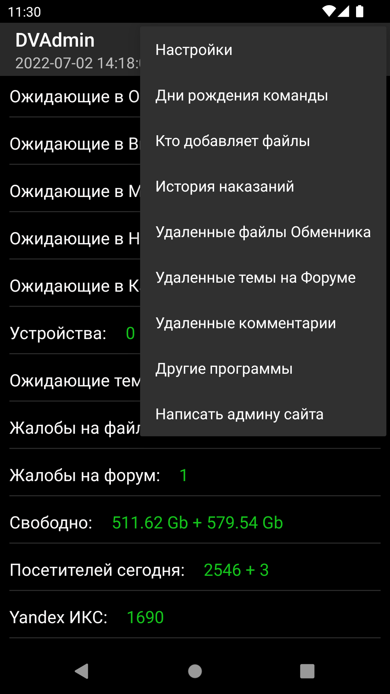

# DVAdmin
DVAdmin - программа для автоматического получения следующей информации с сайта:

- виджет с количеством непрочитанного
- просмотр удаленных файлов Обменника с причиной удаления
- количество ожидающих материалов в разделах, с возможностью перехода в браузере.
- гибко настраиваемые уведомления о новых материалах в одобрялке.
- показывает, кто из команды находится сейчас на одобрении.
- показывает дни рождения команды в текущем месяце.
- показывает сводку самых активных в одобрялке.
- показывает дату и время последнего обновления сайта (кеша).
- показывает историю наказаний юзеров.
- имеет настройки автообновления, выбора сети для проверки, возможность ручного обновления.
- опция "Ключ команды" позволяет переходить сразу в нужные разделы админки (команда может в личку этот код у меня запросить).
- показывает кто из пользователей сейчас добавляет файлы
- возможно выбрать показ количества только из определенных категорий

Программа использует специально написанные мной апи сервера для минимального потребления трафика, передается лишь текст один.
